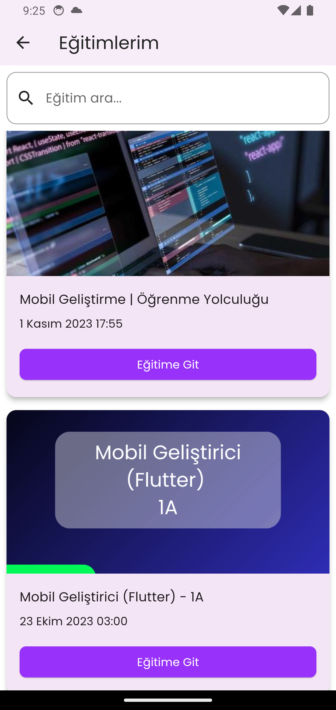
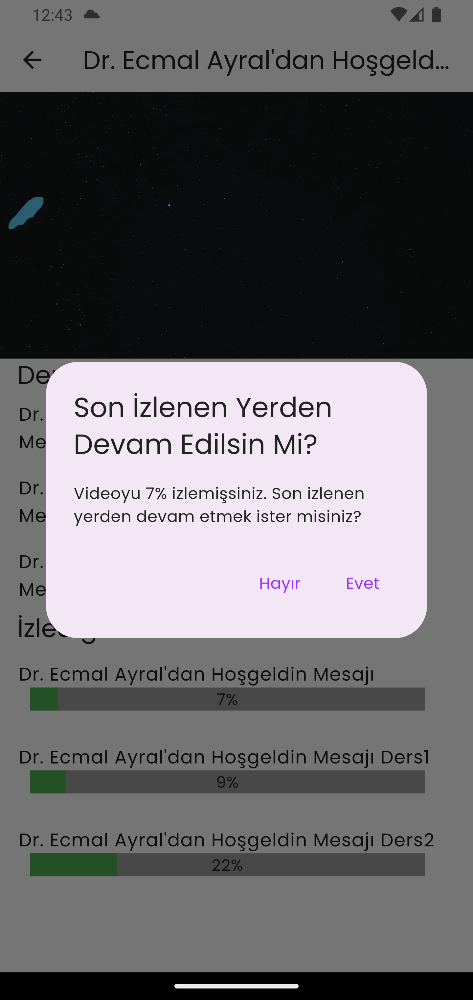
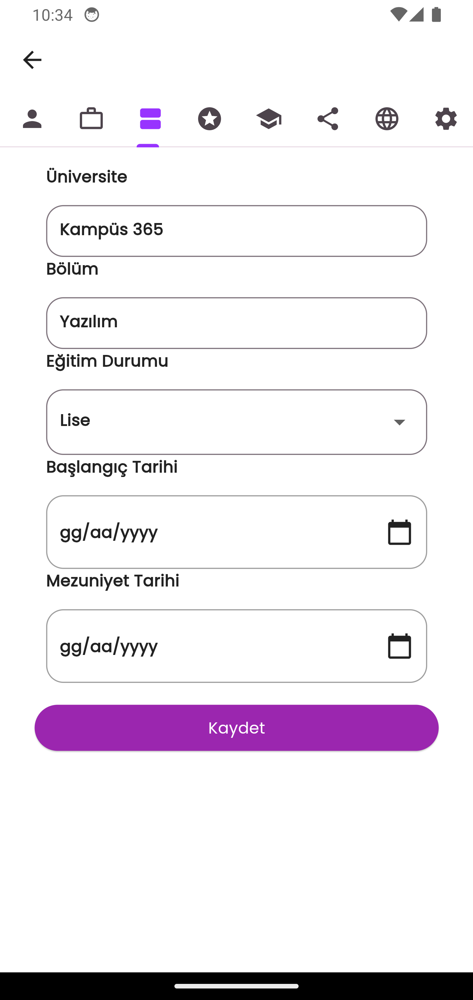

# tobeto_app

## Proje Tanıtımı
- Kullanıcıya eğitim içerikleri sunan kişisel gelişim odaklı bir platform olan Tobeto'nun mobil uygulama prototipidir.

## Renk Referansı

| Renk             | Hex                                                                
| ----------------- | ------------------------------------------------------------------ 
| Tobeto primary |   #9833FF |
| Tobeto secondry |  #00D29B |
| Tobeto backgroundColor |  #FFFFFF |
| textColor |  #515151   | 
| boxColor  |  #0E0B93 | 
| favoriteButtonColor  |  #FE4657 | 

## Ekran Görüntüleri
 

## Welcome Page (Splash Ekranı)
 

 

## Register - Login Page / Google Auth Page (Kayıt-Giriş Ekranı)
 

 

## Home Page (Ana Sayfa)
 

 

## Home Page / Information menu (Anasayfa-Bilgilendirme Menüleri)
- Başvurularım

 

- Duyuru ve Haberlerim

 

- Anketlerim

 

- Eğitimlerim

  

- Eğitimlerim (Eğitim Videosu İzlenme Verileri)

###### Video Kaydedilen Son Veriden Devam Ediyor

  

###### Video Verisi Güncellenerek Kaydediliyor

  

###### Video İzleme İşlemi Sona Erdiğinde Play Butonu Deaktif Duruma Geçiyor

  

## Home Page / exams menu (Anasayfa-Sınavlarım Menüleri)
- Sınavlarım

 

## Reviews Page (Değerlendirmeler Sayfası)
 

 

- Rapor Sayfası

 

- Sınav Sayfası

 

## Profile Page (Profil Sayfası)
 

 

## Profile Edit Page (Profil Düzenleme Sayfası)
 

 

## Catalog Page (Katalog Sayfası)
 

 

## Calendar Page (Takvim Sayfası)
 

 

## Float Action Button (FAB Menü)
 

 

# More (Daha Fazla Göster)
 

